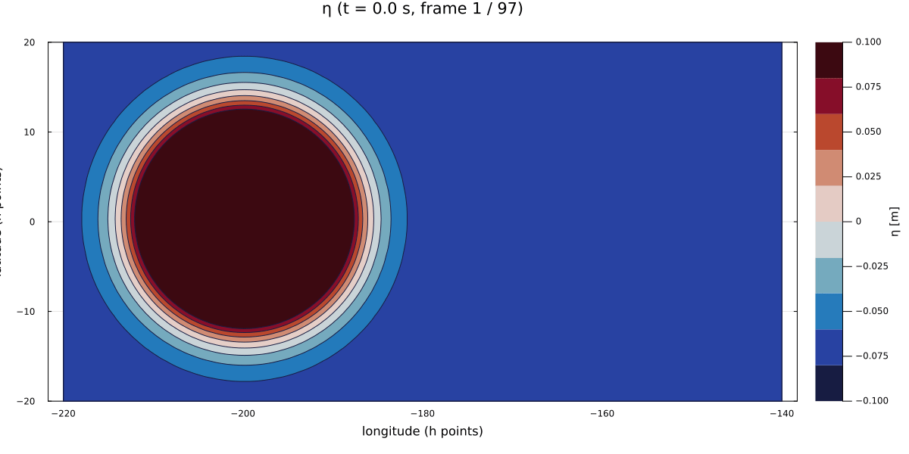

# TwoLayerSW.jl  
GPU-Accelerated Two-Layer Rotating Shallow-Water Model (Julia + CUDA)

`TwoLayerSW.jl` is a GPU-accelerated, C-grid, two-layer rotating shallow-water model with barotropic–baroclinic mode splitting, 5th-order WENO-Z advection, wind stress forcing, bottom drag, Shapiro filtering, and NetCDF output.

The model is designed for idealized and process-oriented studies of:

- Equatorial Kelvin and Rossby waves  
- Barotropic–baroclinic mode interactions  
- Layered ocean dynamics  
- Idealized air–sea interaction experiments  

The core model is implemented as the `TwoLayerSW` Julia module under `src/`, while `run.jl` provides a stand-alone driver script for running simulations.

---

## ✨ Main Features

- **Two-layer rotating shallow-water dynamics**
  - Upper and lower layer thicknesses $ h_1, h_2 $
  - Free surface height $ \eta $ and interface displacement $ \xi $
  - Reduced gravity
    $$ g' = g \, (\rho_2 - \rho_1)/\rho_2 $$

- **Arakawa C-grid staggering**
  - Scalars $ h_1, h_2, \eta, \xi $ at cell centers
  - Zonal velocity components at u-faces
  - Meridional velocity components at v-faces

- **High-order advection**
  - 5th-order WENO-Z (Jiang & Shu, 1996)
  - Flux-form formulation
  - Fully GPU-accelerated kernels

- **Barotropic–baroclinic mode splitting**
  - External (barotropic) mode advanced using subcycling
  - Internal (baroclinic) mode advanced with a larger timestep
  - Barotropic timestep defined as `dtBT = dt / M`

- **Forcing and dissipation**
  - Surface wind stress from prescribed 10-m wind
  - Optional bottom drag
  - Viscous smoothing via parameter `nu`
  - Shapiro filter with strength `smoothing_eps`

- **Boundary conditions**
  - East–West: periodic
  - North–South:
    - Solid walls (no-normal flow)
    - Optional radiation-style boundary behavior

- **NetCDF output**
  - Uses `NCDatasets.jl`
  - Configurable output interval
  - CF-style variables for post-processing

---

## 📂 Repository Structure

```text
.
├── run.jl                 # Stand-alone driver script
└── src/
    ├── TwoLayerSW.jl      # Main module
    ├── params.jl          # Params struct and constructor
    ├── grid.jl            # Grid geometry and metric terms
    ├── stateVars.jl       # Prognostic and auxiliary variables
    ├── reconstruct.jl     # C-grid reconstructions and face velocities
    ├── utils.jl           # Utility helpers
    ├── initial_condition.jl # Initial condition builders
    ├── advection_weno.jl  # WENO-Z advection and flux kernels
    ├── forcing.jl         # Wind stress and bottom drag
    ├── coriolis_curvature.jl # Coriolis and curvature terms
    ├── filters.jl         # Shapiro filtering
    ├── boundaries.jl      # Boundary condition kernels
    ├── barotropic.jl      # External-mode time stepping
    ├── baroclinic.jl      # Internal-mode time stepping
    ├── io_netcdf.jl       # NetCDF output utilities
    └── driver.jl          # High-level `run_twoLayer_SW` driver
```

## 🚀 Running the Model

### 1. Requirements

- Julia **≥ 1.10** (recommended)
- A CUDA-capable NVIDIA GPU
- CUDA toolkit compatible with `CUDA.jl`  
  *(CUDA.jl can automatically download a suitable toolkit if needed)*

The model depends on the following Julia packages:

- `CUDA`
- `NCDatasets`
- `Statistics`
- `Random`
- `ProgressMeter`

You do **not** need to install these manually.  
They are installed automatically using Julia’s package manager.

### 2. Clone the Repository
```text
git clone https://github.com/raickhr/two_layer_sw.git
cd two_layer_sw
```

### 3. Install Dependencies

Start Julia in project mode:
```text
julia --project
```

Then, inside the Julia REPL, run:

```text
using Pkg
Pkg.instantiate()
```

### 4. Run the Default Configuration

Exit Julia and run the model from the terminal:

```text
julia run.jl
```

The default configuration runs a 5-day Kelvin/Rossby wave test case at the equator and writes output to a NetCDF file (e.g. two_layer_SW.nc), which can be analyzed using Julia, Python (xarray), or MATLAB. Initial condtions is a SSH of gaussian bulb of radius 1000 km. The interface between the two layers does not have perturbations

## 🎥 Model Animation

View the GIF below:

